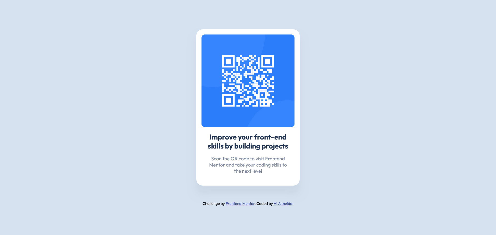

# Frontend Mentor - QR code component solution

This is a solution to the [QR code component challenge on Frontend Mentor](https://www.frontendmentor.io/challenges/qr-code-component-iux_sIO_H). Frontend Mentor challenges help you improve your coding skills by building realistic projects. 

## Table of contents

- [Overview](#overview)
  - [Screenshot](#screenshot)
  - [Links](#links)
- [My process](#my-process)
  - [Built with](#built-with)
  - [What I learned](#what-i-learned)
- [Author](#author)

## Overview

### Screenshot



This is my solution to [Front End Mentor's QR Code Component Challenge](https://www.frontendmentor.io/challenges/qr-code-component-iux_sIO_H).

### Links

- GitHub Repo URL: [Add solution URL here](https://github.com/vi-almeida-design/front-end-mentor-learning-path-1.1)
- Live Site URL: [Add live site URL here](https://vi-almeida-design.github.io/front-end-mentor-learning-path-1.1/)

## My process

### Built with

- HTML5
- CSS3
- VSCode
- Figma

### What I learned

This challenge is very simple, but I realized that I need to understand the ```align``` and ```justify``` properties better. 

I also got stuck with really basic stuff, like centering the two elements (QR Code Card and the Attribution Text below) in the page. I was unable to properly align them vertically because the ```body``` of my document was as tall as those two elements.

I just needed to use ```max-height:100vh``` and it'd be good to go.
*

## Author

- Website - [vi-almeida-design](https://github.com/vi-almeida-design)
- Frontend Mentor - [@vi-almeida-design](https://www.frontendmentor.io/profile/vi-almeida-design)

```
My name is Vinícius, but it might be easier to just call me Vi or Vini. I'm an undergraduate Graphic Designer.

Currently I'm dabbling into HTML/CSS on my free-time because it's genuinely fun and because it's a nice skill to have since I want to be able to work on Web-Design (although I'm more than aware that it's not a requirement in the slightest).
```
